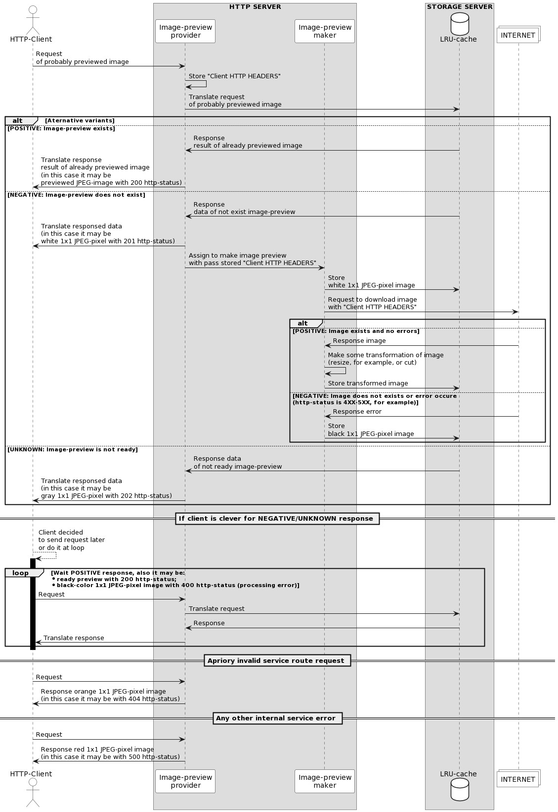
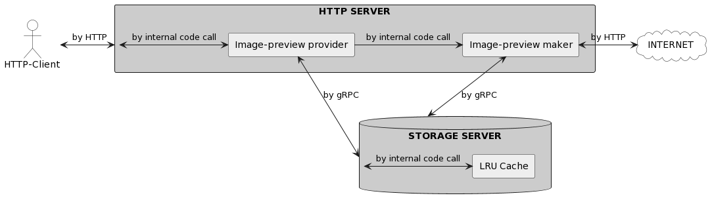
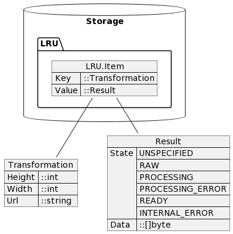
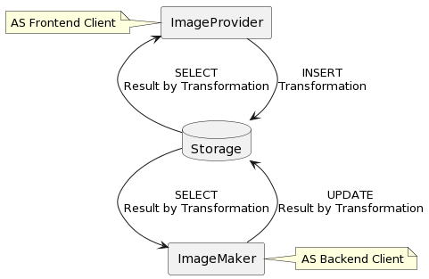

# Image-preview service ("Сервис предпросмотра изображений")

Проектная работа выпускника курса "Golang. Professional" платформы онлайн-образования [Отус](https://otus.ru).

Описание требований:

* [Общие](https://github.com/OtusGolang/final_project).
* [Частные](https://github.com/OtusGolang/final_project/blob/master/03-image-previewer.md).

Тезисно:

* реализовать `HTTP`-сервис предпросмотра изображений с их кешированием;
* масштаб задается `HTTP`-клиентом — инициатором `HTTP`-запроса;
* при проксировании `HTTP`-запроса клиентские `HTTP`-заголовки перенаправляются целевому ресурсу, содержащему оригинал обрабатываемого `HTTP`-сервисом изображения.

## Почему этот проект

Проект "Сервис предпросмотра изображений" интересен, так как:

* решаются задачи в области кибербезопасности и защиты информации:
  * реализуется `MITM`-образный алгоритм (изменение и фильтрация содержания трафика элементом по-середине):
    * предобрабатывается запрос к целевому сервису (формируются `HTTP`-заголовки, не допускаются повторные запросы);
    * предобрабатывается ответ источнику запроса (клиенту возвращается неоригинальное изображение, подменяется `HTTP`-статус ответа);
  * пользователь защищается от "фишинга" и "трекинга", так как от целевого ресурса скрывается истинный источник запроса, и как следствие позволяет осуществить обход блокировки целевого ресурса, установленной им в отношении пользователя;
  * целевой ресурс защищается от отказа в обслуживании (`DDoS`) при однотипных запросах, так как осуществляется кеширование их результатов;
* на базе него возможно разработать иные сервисы, в частности, системы хронологического учета изображений, онлайн-редакторы изображений и пр.;
* результаты применения алгоритмов обработки изображений видны сразу и не требуют дополнительной агрегации, как это предполагается в курсовых работах по иным тематикам (например, необходимость представления дополнительными программными продуктами аналитических результатов обработки показателей учитываемых сервисами метрик).

## Проектирование

Допущения к условиям задачи:

* сервис проксирует только `Get`-запросы к целевому `HTTP`-ресурсу;
* ссылка на "предпросматриваемое" изображение не целевом `HTTP`-ресурсе не содержит:
  * параметров запроса (отсутствуют `...?param1=value1&param2=value2`);
  * якорей страницы (отсутствуют `...#place_at_document`);
  * протокола работы (отсутствуют `http://` и `https://`, загрузка происходит по `http://`);

Авторское дополнение:

* сервис всегда возвращает изображение. Так, для визуального представления стадий работы алгоритма применяются однотонные 1х1-пиксели. На техническом уровне состояние процесса обработки данных демонстрируется в виде соответствующих `HTTP`-статусов, сопровождающих возвращаемые сервисом изображения.

### Процесс взаимодействия

> __Замечание__: поясняющие схемы и диаграммы технического характера выполнены посредством платформы [plantuml.com](https://plantuml.com/en/). При ее использовании итоговое изображение для его встраивания в отчеты рекомендуется сохранять в виде `PNG`-файла, избегать `SVG`-формата и динамического его формирования с задействованием индивидуальных ссылок-генераторов.

Диаграмма последовательностей запросов и ответов:



<details>
<summary>см. код для генерации схемы на сайте https://plantuml.com</summary>

```text
@startuml

actor             "HTTP-Client"                   as Client #FFF
box "IMAGE-PREVIEW SERVICE"
    box "HTTP SERVER"
        participant   "Image-preview\nprovider"   as ImageProvider  #FFF
        participant   "Image-preview\nmaker"      as ImageMaker     #FFF
    end box
    box "STORAGE SERVER"
        database    "LRU-cache"                   as Database #FFF
    end box
end box
collections  "INTERNET"                           as Internet #FFF

Client          ->   ImageProvider  : Request\nof probably previewed image
ImageProvider   ->   ImageProvider  : Store "Client HTTP HEADERS"
ImageProvider   ->   Database       : Translate request\nof probably previewed image

alt  Aternative variants

else POSITIVE: Image-preview exists

Database        ->   ImageProvider  : Response\nresult of already previewed image
ImageProvider   ->   Client         : Translate response\nresult of already previewed image\n(in this case it may be\npreviewed JPEG-image with 200 http-status)

else NEGATIVE: Image-preview does not exist

Database        ->   ImageProvider  : Response\ndata of not exist image-preview
ImageProvider   ->   Client         : Translate responsed data\n(in this case it may be\nwhite 1x1 JPEG-pixel with 201 http-status)
ImageProvider   ->   ImageMaker     : Assign to make image preview\nwith pass stored "Client HTTP HEADERS"
ImageMaker      ->   Database       : Store\nwhite 1x1 JPEG-pixel image
ImageMaker      ->   Internet       : Request to download image\nwith "Client HTTP HEADERS"

alt  

else   POSITIVE: Image exists and no errors

Internet        ->   ImageMaker     : Response image
ImageMaker      ->   ImageMaker     : Make some transformation of image\n(resize, for example, or cut)
ImageMaker      ->   Database       : Store transformed image

else NEGATIVE: Image does not exists or error occure\n(http-status is 4XX-5XX, for example)

Internet        ->    ImageMaker     : Response error
ImageMaker      ->    Database       : Store\nblack 1x1 JPEG-pixel image

end

else UNKNOWN: Image-preview is not ready

Database        ->    ImageProvider  : Response data\nof not ready image-preview
ImageProvider   ->    Client         : Translate responsed data\n(in this case it may be\ngray 1x1 JPEG-pixel with 202 http-status)

end

== If client is clever for NEGATIVE/UNKNOWN response ==

Client -->   Client : Client decided\nto send request later\nor do it at loop

loop Wait POSITIVE response, also it may be:\n*ready preview with 200 http-status;\n*black-color 1x1 JPEG-pixel image with 400 http-status (processing error)

activate Client #000

Client            ->   ImageProvider  : Request
ImageProvider     ->   Database       : Translate request
Database          ->   ImageProvider  : Response
ImageProvider     ->   Client         : Translate response

end

deactivate Client

== Apriory invalid service route request ==

Client            ->    ImageProvider  : Request
ImageProvider     ->    Client         : Response orange 1x1 JPEG-pixel image\n(in this case it may be with 404 http-status)

== Any other internal service error ==

Client            ->    ImageProvider  : Request
ImageProvider     ->    Client         : Response red 1x1 JPEG-pixel image\n(in this case it may be with 500 http-status)

@enduml
```

</details>

[Ссылка ✎ https://www.plantuml.com](https://www.plantuml.com/plantuml/uml/lLPHS-8s47xthzYXBvTEF2KtkHSwwHnpv-HeUuG1Bia3By9QG7D2wqg2G7zz8yi8SAoEBzEf7XB6bdVt-_RxLae-6ikqtQnbah3SaeRJrVaodOxIJrAWiXs8B6R0xu2VRczlapdje3Fush_Bqj4uUnXaZp39nW-3JradSTlT-p9k-JWR-wTk5KnRaOk2AUjo3zPiYMcXSIlmUQOAJLl1KNTyolBjg7e6FdMxG6lstKSv2VJLFGEtGY1KtDLwh7aolH-_e7fLDcUMpPd1ah0_nz_IdEKhx3GpzRdQ_3hFuNzEKc9k1IdZQXzEi_4mcqRO3o2KHQsmQa5IzIEiz3U0EcCz6EDV6pHsfcW1XQOvcyizL3GX1-7s9xMl8g4cbZH2fyfRTlTBrl-SZIUTvWY11xzwCDLC6SaiWcvJLiAa1UWxrCoABSAMQS6KDKc2qY2CxYU3wU0Xwy5Pzm5tmhXDjVnHXan1ok1CQJGRQO4MmAH6nbiI5HhH1BDrx9bw9nJObJ2Gkvg5XJNRm_pbnN7dxwFiBYstmxEmAtZVxSBAsY8rbjcDkQY86MPt_IPYEA41HTOpzEC4EHSu2244YDFuRwQ7WulyBmmyhuH5kDfTUGOAiKDvOE3gd8766ch-xq7V6B5KO0dSfF0m84oFCdB1Z07ZDC_ZeZz6ZOhUsIO2mUTjZXFSxbTmigkPqxEIn89oNBsH6hs7Abr0tJALLO0f3ee0jIPjagIMkvd3e8jc596Ft6ymj4QmJWOBqclcvY3G8lX0en5_uoMyl0JSiNKXyH98Gxwn5pz2-Z55C72ZFsg-C43QKm6KvnljIZgH60W3rqzFwOUdfxCIBoAynOdpIPeHHNKqbop_tgmZTxnK2ByD_nZUFmxh0q1ucEK0YjW_xl_AfBGuncZX__zc02mrsqVy__xS_vw4cniOB23tcLqyYLlKhbsX-RzK78KYuEOcdAhfwUZg7Nvmp0L7FbEMmA3YXsCC71WzKwI1aokRMP14HPAul_38X0tE2-akWKb3Hv2zcVhvx6He7F6_lkmg9P3c94at2i5_U7t-8RmhDELeZ51BBxoByZOejinYkDnrkzt00RIyMzJRtlxuFrDWcoCeaggDn2fXSAnXBhNIBxGWlGUXjamA3WRrLkG8cZR7Qfq-8joq9oVkYc0pqamjcu-Ac4D2owzhPd3Or1x8hb23ACSJam5UAOF_2vP6_XPC7rvTSJwYufkr_0S0)

> __Замечание__: исходя из поведения `ImageProvider`-а и `ImageMaker`-а, этим сущностям предоставляются различные права на взаимодействие с хранилищем. Так, у `ImageProvider`-а не должно быть возможности вставить данные результата трансформирования изображения, так как это создает угрозу возможности влияния `Frontend`-клиентом на результат преобразования (осуществлять подмену). В проекте `ImageProvider` и `ImageMaker` представлены двумя разными интерфейсами с методами "Insert"+"Select" (т.н. `Frontend`-клиент хранилища) и "Update"+"Select" (т.н. `Backend`-клиент хранилища) соответственно.

> __Замечание__: поэтапный процесс трансформации с фиксацией результатов в хранилище приводит к тому, что перемещение трансформации вверх по `LRU`-кэшу происходит несколько раз за один цикл первичной обработки. Так, последовательность событий: "трансформация помещена в кеш", обновлен статус трансформации на "создан", "изменен", "готов", по итогу - "обновлены данные с результатом",- c точки зрения `LRU`-кэша приводит к искусственному завышению популярности создаваемой трансформации. Однако при условии неинтенсивного использования разработанного сервиса с большим значением вместимости `LRU`-кэша данное обстоятельство вполне допустимо, так как запрашиваемый на создание элемент `LRU`-кэша и так должен оказаться в его вершине.

### Протоколы взаимодействия

Диаграмма протоколов взаимодействия:



<details>
<summary>см. код для генерации схемы на сайте https://plantuml.com</summary>

```text
@startuml
skinparam componentStyle rectangle
actor "HTTP-Client" as Client #FFF
component "HTTP SERVER" as HTTPSERVER #CCC {
  [Image-preview provider] #EEE
  [Image-preview maker] #EEE
}
cloud INTERNET as INTERNET #FFF
database "STORAGE SERVER" as Storage #CCC {
  [LRU Cache] #EEE
}

[Client] <-> HTTPSERVER                 : by HTTP
HTTPSERVER <-> [Image-preview provider] : by internal code call
[Image-preview provider] <-> Storage    : by gRPC
[Image-preview provider] -> [Image-preview maker] : by internal code call
[Image-preview maker] <--> Storage      : by gRPC
Storage <-> [LRU Cache]                 : by internal code call
[Image-preview maker] <-> INTERNET      : by HTTP
@enduml
```

</details>

[Ссылка ✎ https://www.plantuml.com](https://www.plantuml.com/plantuml/uml/bL7BQiCm4BphAvRux1ye8IG8kGsKDCXkBo67ZRou9deOMKu9fV_Ur2h2q1hQspvcDBEZTH_GXy5erfzRsw570ygPpbcoeGnNJU191RID9eOgE0-BXwhQvrotDyG2i8TOGbOK1KlS28DIo1SXHzXN7rl8EEVmpW0EMuCDvPsdIqjlq7btQMloHyY443_t1izf-S6KTaCDsrqbv4vKW7sgevSQ0vwm9rYKrPFSt8laPbD26Pp7XYPM7kKpS5Ilb0JO8PvsX6M-clg_WzDrxDbaUCFCtXCPhGtaBMfGhYPGg3MR8OoAoUD8RkIUpyEJzZIhFmidz3B_LVPx4azCEVt_yLNweKc4QxBrOFGd)

### Хранение данных

`LRU`-кэш представляет собой хранилище типа "ключ-значение". В рамках данной задачи элемент кеша имеет вид:



<details>
<summary>см. код для генерации схемы на сайте https://plantuml.com</summary>

```text
@startuml

json "Transformation" as T {
  "Height":"::int",
  "Width": "::int",
  "Url":   "::string"
}

json "Result" as R {
  "State": ["UNSPECIFIED", "RAW", "PROCESSING", "PROCESSING_ERROR", "READY", "INTERNAL_ERROR"],
  "Data":  "::[]byte"
}

database Storage {
  json LRU.Item {
    "Key":   "::Transformation",
    "Value": "::Result"
  }
}

Storage.LRU.Item -- T
Storage.LRU.Item -- R

@enduml
```

</details>

[Ссылка ✎](https://www.plantuml.com/plantuml/uml/RP3HQeCm58RlVOh3kMxx05vLQhR9YYrHLqOf8yKpcw4HakD5ANltnMZ7DdQLvClXu__Fsh6oF7Hj57sutW2MLXdttjjEiUuDWd9GmYq2m2VIpOKnnZZMXd4nieEk-O8n_6ILRJs1aJcssZGOVTxjajpGSh3AoLgmOlBpHwpoOYyssKCcKbpuqUGm7dkvsuYYoFB7twyt8ULEXa6HfA_Z9SjB8VDaEt-TGffKiS8uf3cUpbUcaARszAmSGS6zLGt1RGgubTKgO-gcRCzqlJVvivQWVb7jG5FvkPTNU_diN7tBbaie_wKoMfEf_VQ_0000)

### Аспект взаимодействия с хранилищем

Согласно приведенной выше схеме, `ImageProvider` и `ImageMaker` по правам доступа к хранилищу имеют разные роли:



<details>
<summary>см. код для генерации схемы на сайте https://plantuml.com</summary>

```text
@startuml

agent ImageProvider
database Storage 
agent ImageMaker

ImageProvider <- Storage :SELECT\nResult by Transformation
ImageProvider --> Storage :INSERT\nTransformation
Storage  -> ImageMaker :SELECT\nResult by Transformation
ImageMaker --> Storage :UPDATE\nResult by Transformation

note left of ImageProvider : as Frontend Client
note right of ImageMaker : as Backend Client

@enduml
```

</details>

[Ссылка ✎](https://www.plantuml.com/plantuml/uml/ZP1FIiSm48NtESLSe1Se8gqrGa6bD7NdPchJ6fecC9aAtjvPMFjd8RzL0lDzlCSh4YFnkdY5amqCzI9lG_7B3PRKW8mz9Wk68ya1ZjGBpeAeam5tsH-R6_sig-uzj3Qjdg7_Xeumf37IWknYkAXPTh-xzQlHhRWNOxk3i7k9MwC4lkQyDOzbf_yHLOXimTkH8OvmRfn3QU29Oc0R1gYyasr-1NBJvsv8y8O_uCTye0lvo_e_)

Соответственно для поддержания такой программной архитектуры для `ImageProvider`-а и `ImageMaker`-а определены разные [интерфейсы](previewer/interfaces/storager.go) взаимодействия с хранилищем.

> __Замечание__: потенциально в дальнейшем это также позволит разнести эти два модуля на разные микросервисы с атомарной ответственностью для каждого.

## Разработка

### Сторонний код

Одним из требований к курсовым работам является условие [использования сторонних библиотек для core-логики](https://github.com/OtusGolang/final_project#использование-сторонних-библиотек-для-core-логики), предполагающее снижение сторонней кодовой базы в проекте.

Так, за исключением собственных наработок:

* [https://github.com/BorisPlus/leveledlogger](https://github.com/BorisPlus/leveledlogger) - пакет, поддерживающий уровни журналирования: `Debug`, `Info`, `Warning`, `Error`;
* [https://github.com/BorisPlus/lru](https://github.com/BorisPlus/lru) - пакет для реализации кеширующего сервиса (`LRU`-кэш, ограниченный по количеству элементов);
* [https://github.com/BorisPlus/regexphandlers](https://github.com/BorisPlus/regexphandlers) - пакет для реализации `REST Api`-подобных `URL`-путей по шаблонам регулярных выражений и их обработчиков;
* [https://github.com/BorisPlus/exthttp](https://github.com/BorisPlus/exthttp) - пакет для запуска обособленного `HTTP`-сервера, предоставляющего `HTTP`-клиенту изображение (динамически генерируемы зеленый квадрат) и ведущего лог `HTTP`-заголовков обращений к нему (необходим как при `UNIT`-тестировании, так и при интеграционном);

репозитории иных разработчиков не использовались.

"DIY"-подход (_прим. —  "Do it yourself"_) является ключевой особенностью авторской реализации курсовой работы.

> __Замечание__: Часть авторской кодовой базы помещена в специальные файлы-тесты (`_test`) с объединением их в общий тестовый пакет (`_test`), в частности в рамках интеграционного тестирования (см. директорию [docker.integration-test](./docker.integration-test)). Данное обстоятельство приводит к учету в `go.mod` файле только тех компонентов, которые задействуются при непосредственной работе продукта.

Функция масштабирования разработана на основе условно "штатного" Golang-пакета `golang.org/x/image/draw`. При этом она поддерживает как уменьшение масштаба (снижение скалярного размера), так и его увеличение (растяжение).

### Эффект асинхронности

В идеале, `ImageProvider` и `ImageMaker` не должны функционировать в едином окружении (контейнере). Их необходимо разнести по разным самодостаточным микросервисам (каждый со своей атомарной ответственностью), в частности, посредством введения "очереди запросов" (представленной, например, `RabbitMQ`) и учета в ней `HTTP`-заголовков клиентских запросов изображений, которые (_прим. - заголовки_) транслируются от `HTTP`-клиента через `ImageProvider`-а к `ImageMaker`-у и далее по цепочке к целевому `HTTP`-ресурсу.

Как описано выше, `ImageProvider` взаимодействует с `ImageMaker`-ом непосредственно через кодовый вызов. В обычном варианте этот факт влечет синхронность, то есть `HTTP`-клиент при запросе предпросмотра нового для системы изображения (или новой его трансформации) будет ожидать завершения работы всего стека. Это приводит к увеличению времени ответа.

Асинхронности возможно добиться, как предложено ранее, разнесением `ImageProvider`-а и `ImageMaker`-а на отдельные микросервисы с внедрением промежуточного буфера (очереди запросов), моментально возвращающего управление `ImageProvider`-у обратно.

Однако в текущем проекте "эффект асинхронности" достигнут благодаря ["хайджекингу"](https://pkg.go.dev/net/http#example-Hijacker). `HTTP`-вызов со стороны `HTTP`-хендлера подменяется сырым `TCP`-соединением (`rw.(http.Hijacker) ... conn, bufrw, err := hj.Hijack()`). Ответ формируется "вручную" согласно спецификации `HTTP`-протокола. `TCP`-соединение закрывается сразу после сформированного сообщения `HTTP`-клиенту, но процесс загрузки и трансформации изображения продолжает работать в том же самом потоке исполнения [`HTTP`-хендлера](previewer/http/servemux/handlers/transformations/narrow.go).

> __Замечание__: задействование "хайджекинга" возможно исключительно в рамках `HTTP/1`. Данное обстоятельство учтено в реализации.

### О пикселях, HTTP-статусах и состояниях готовности изображений

Так, `ImageProvider`, если не имеет изображения-кандидата на предоставление `HTTP`-клиенту, делегирует `ImageMaker`-у создание изображения путем передачи параметров трансформации (высота, ширина, `URL` изображения) и перечня проксируемых на целевой ресурс `HTTP`-заголовков. При этом в ответе по ходу исполнения запроса (в частности, повторные обращения пользователя-инициатора или параллельные от иных пользователей) предъявляются монотонные однопиксельные изображения:

* белый — "запрос на создание принят";
* серый — "запрос в обработке";
* зеленый — "изображение загружено";
* черный — "обработка изображения завершилась с ошибкой";
* оранжевый — "обработка завершилась с ошибкой", которая не учтена разработчиком как "черная" (например, отсутствие соединения со хранилищем);
* красный — какая-либо "внутренняя ошибка сервера";

с определенным `HTTP`-статусами, соответствующими этапам обработки изображения:

* факт того, что трансформация учтена в БД (`RAW`)- 201 `HTTP`-статус (`http.StatusCreated`);
* факт того, что трансформация обрабатывается (`PROCESSING`) - 202 `HTTP`-статус (`http.StatusAccepted`);
* факт того, что трансформация завершена с ошибкой (`PROCESSING_ERROR`) - 400 `HTTP`-статус(`http.StatusBadRequest`);
* факт того, что превью готово (`READY`) - 200 `HTTP`-статус (`http.StatusOK`);
* факт того, что превью не может быть сделано (`INTERNAL_ERROR`, по разным алгоритмическим причинам, в частности, "не правильный путь обращения к сервису", "не JPEG в целевом источнике") - 404 `HTTP`-статус (`http.StatusNotFound`);
* факт возникновения ошибки низкого уровня (неалгоритмического характера) — 500 `HTTP`-статус "внутренняя ошибка сервера" (`http.StatusInternalServerError`).

> __Замечание__: изначально ряд `HTTP`-статусов имел код емкости `1XX`. Однако обнаружено, что их возврат все равно приводит к автоматическому ответу 200-ым статусом со стороны `Golang`. Вариант возврата `1XX` `HTTP`-статусов требует большей проработки, по факту код выглядит нагруженным. Поэтому стало необходимым отказаться от возможно более подходящих по семантическому значению `HTTP`-статусов.

## Тестирование

### Ручное

В двух отдельных терминалах запустить микросервисы

`LRU`-хранилища:

```bash
make run-storage
```

и `HTTP`-сервера:

```bash
make run-http
```

Далее посредством Интернет-браузером открыть специально подготовленный авторский `HTML`-файл [ALL_TESTS_AT_ONE_PAGE.8080.html](README.files/ALL_TESTS_AT_ONE_PAGE.8080.html), в котором продемонстрированы три варианта работы:

* изображение загружается со стороннего `HTTP`-ресурса, при этом предварительно предъявляется белый пиксель, свидетельствующий, что кеширование запущено;
* осуществляется попытка загрузки изображения со стороннего `HTTP`-ресурса, но ее там нет. В результате пользователю предъявлен черный пиксель;
* обращение идет по невалидному пути к разработанному сервису предпросмотра. В результате пользователю незамедлительно предъявляется оранжевый пиксель.

Все изображения данного `HTML`-файла также доступны для демонстрации непосредственно на сервисе предпросмотра по щелчку, а не в виде встроенных элементов. В режиме отладки Интернет-браузера видно, что изображения (белый, черный, оранжевый 1x1 пиксель и реальное изображение) сопровождаются соответствующими `HTTP`-статусами.

> __Замечание__: автоматическое обновление происходит посредством встроенного `JavaScript`. Если в рамках данного тестирования завершить микросервис хранилища, то соответствующие изображения поменяют цвет на монохромный красный.

### Unit-тестирование

> __Замечание__: тестирование обособленных внешних авторских пакетов:
>
> * [https://github.com/BorisPlus/leveledlogger](https://github.com/BorisPlus/leveledlogger);
> * [https://github.com/BorisPlus/lru](https://github.com/BorisPlus/lru);
> * [https://github.com/BorisPlus/regexphandlers](https://github.com/BorisPlus/regexphandlers);
>
> реализовано непосредственно внутри них. Тестирование ряда функционала, базирующегося на этих пакетах, приведено ниже.

> __Замечание__: в качестве подхода к тестированию избран вариант организации "обособленного" пакета тестов с суффиксом `_test`, задействующего исходный пакет путем его импорта.

#### Тестирование хранилища

```bash
make test-storage
```

Результат имплементации `LRU`-кеша с разделением логики взаимодействия с хранилищем на две роли (`Frontend`: "SELECT"+"INSERT" и `Bаckend`: "SELECT"+"UPDATE") проверяются на факты ([тест](previewer/storage/test/rpc_test.go)):

* вставки трансформаций и результатов;
* хранения трансформаций и результатов в кеше так, как они были туда помещены или изменены;
* вытеснения старых элементов новыми.

#### Тестирование базовых функций приложения

Проводится проверка работы функций скачивания и масштабирования изображений с применением внешнего Интернет-ресурса (необходим сетевой доступ):

```bash
make test-app-functions-with-foreign-image-server
...
```

или локально поднимаемого HTTP-сервера ([ExtHTTP](https://github.com/BorisPlus/exthttp)):

```bash
make test-app-functions-with-internal-image-server
...
```

В рамках тестирование проводится проверка соответствия результатов скачивания и масштабирования их эталонным значениям, учтенным в виде [байт-кодового представления](previewer/app/functions/ethalon_test.go).

> __Замечание__: [ExtHTTP](https://github.com/BorisPlus/exthttp) - специально разработанный для данного проекта `HTTP`-сервер. Предоставляет по `HTTP`-протоколу зеленый JPEG-квадрат и ведет логи `HTTP`-заголовков запроса. Он задействуется как внешний (сторонний) по отношению к проекту сервер.

#### Тестирование HTTP-сервиса

```bash
make test-http_service
```

запускает:

* тестирование вариантов запуска и останова `HTTP`-сервиса;
* тестирование `Middleware`;
* тестирование ошибок при неправильной маршрутизации запроса к `HTTP`-сервису (проверяется `HTTP`-статус и возвращаемое сервисом изображение);
* тестирование интерактивного взаимодействия с `HTTP`-сервером, предоставляющего результат обработки внешнего изображения, получаемого от `ExtHTTP`, и корректности `HTTP`-статусов, сопровождаюших это взаимодействие.

#### Проверка конфигураций

Для конфигурирования сервисов решено использовать `JSON`-файлы, так как возможность работы с ними штатно реализована в Gоlang. Все имеющиеся файлы конфигурации проверяются на факт их валидности по отношению к специально разработанным классам конфигураций.

```bash
make test-config

...
2023/10/01 10:08:10 Test case for the file ../../config/http_service.json
...
2023/10/01 10:08:10 Test case for the file ../../docker/config/http_service.json
...
2023/10/01 10:08:10 Test case for the file ../../docker.debug/config/http_service.json
...
2023/10/01 10:08:10 Test case for the file ../../config/storage_service.json
...
2023/10/01 10:08:10 Test case for the file ../../docker/config/storage_service.json
...
2023/10/01 10:08:10 Test case for the file ../../docker.debug/config/storage_service.json
...
2023/10/01 10:08:10 Test case for the file ../../docker.debug/config/fullstack_client.json
...
2023/10/01 10:08:10 Test case for the file ../../docker.debug/config/exthttp_service.json
...
PASS
ok      previewer/config        0.082s
```

#### Покрытие

``` bash
make show-cover
...
go test ./previewer/storage/test/ -coverpkg=./.../server
ok      previewer/storage/test  2.051s  coverage: 89.7% of statements in ./.../server
go test ./previewer/storage/test/ -coverpkg=./.../client
ok      previewer/storage/test  2.071s  coverage: 80.6% of statements in ./.../client
go test ./previewer/storage/test/ -coverpkg=./.../rpc/api  
ok      previewer/storage/test  2.069s  coverage: 60.5% of statements in ./.../rpc/api
go test ./previewer/storage/test/ -coverpkg=./.../common 
ok      previewer/storage/test  2.054s  coverage: 92.3% of statements in ./.../common
go test ./previewer/storage/test/ -coverpkg=./.../models
ok      previewer/storage/test  2.067s  coverage: 85.7% of statements in ./.../models
go test ./previewer/app/functions/ -cover
ok      previewer/app/functions 2.232s  coverage: 65.9% of statements
go test ./previewer/http/ -cover
ok      previewer/http  21.107s coverage: 83.3% of statements
go test ./previewer/http/ -coverpkg=./...
ok      previewer/http  21.090s coverage: 68.9% of statements in ./...
go test ./previewer/config/ -cover
ok      previewer/config        0.022s  coverage: 85.7% of statements
```

### Интеграционное тестирование

Для проведения интеграционного тестирования разработан специальный [Fullstack-клиент](previewer/integration/fullstack_client/fullstack_client.go), обладающий необходимыми возможностями по перепроверке циркулирующих в сервисе данных со всех точек внешнего и внутреннего взаимодействия:

* `Frontend`-клиент хранилища для имитации низкоуровневого `ImageProvider`;
* `Backend`-клиент хранилища для имитации низкоуровневого `ImageMaker`;
* `HTTP`-клиент для порождения запросов к разработанному `HTTP`-сервису предпросмотра и внешним `HTTP`-серверам с изображениями для сверки результатов трансформаций - изображения, пропущенного через разработанный сервис, и нативного, исполненного через внутреннюю функцию;
* Файловый клиент для чтения специально подготовленной директории логов, куда записываются поступившие к `HTTP`-серверу `HTTP`-заголовки.

> __Замечание__: Мне видится, что подобный подход с применением `Fullstack`-клиента является весьма эффективным как при Unit-тестировании, так и при интеграционном. Однако, данный компонент, обладая полным и более низкоуровневым доступом ко всем частям продукта, опасен. Его необходимо размещать исключительно в рамках обособленного тестового пакета (`*_test`).

Методы `Fullstack`-клиента в случае ошибки просигнализируют определенным кодом выхода `os.Exit`

* `CheckNotExists(fixtures...)` - проверка того, что трансформации отсутствуют в хранилище;
* `CheckFailTargets(fixtures...)` - проверка того, что трансформации будут иметь негативный результат (так как конечный сервер не существует);
* `CheckChangeStatus(fixtures...)` - проверка того, что изменяемые со стороны `Backend`-клиента статусы, воспринимаются ожидаемо `Frontend`-клиентом и `HTTP`-клиентом;
* `CheckDefaultRoute()` - проверка того, что сервис предпросмотра вернет ошибочное состояние на неправильный путь обращения к нему;
* `CheckTransformationRequest(fixtures...)` - проверка того, что масштабируемые сервисом изображения, скачиваемые со специального интеграционного контейнера с `NGINX`-сервером, совпадают с их эталонными оригиналами (также хранящимися на этом `NGINX`-сервере);
* `CheckProxiedHeaders(fixtures...)` - проверка того, что отправляемые `HTTP`-клиентом `HTTP`-заголовки, проксируясь сервисом предпросмотра, поступают в исходном виде к целевому `HTTP`-серверу (в тесте задействуется ранее описанный `ExtHTTP`).

__Замечание__: для `CheckTransformationRequest(fixtures...)` масштабированные эталоны создаются на удаленном сервисе динамически.

__Замечание__: `NGINX`-сервер может влиять на отправляемое `HTTP`-клиенту изображение ввиду его сжатия в трафике, что приведет к ошибкам сравнения результата масштабирования изначального изображения с эталонным оригиналом, хранящимся также на `NGINX`-сервере. Для теста подобраны не приводящие к такого рода ошибкам размеры масштабирования (50х50, 100х100 и "как есть" 0х0).

```bash
make integration-test
```

### GitHub-тестирование

Дополнительно вышеуказанные тесты запускаются на GitHub при каждом новом Push, если сообщение-комментарий не содержит подстроки `noact` (задействуется механизм [workflows GitHub-actions](.github/workflows/actions.yml)).

## Продуктовая демонстрация

```bash
make docker-compose
....
docker ps
  CONTAINER ID   IMAGE                      COMMAND                ... PORTS                                       NAMES
  8bcb854ffd23   previewer-http-server      "/opt/service/servic…" ... 0.0.0.0:8080->8080/tcp, :::8080->8080/tcp   previewer-http-server
  b48d610f1dfa   previewer-storage-server   "/opt/service/servic…" ...                                             previewer-storage-server
```

> __Замечание__: кэширующий сервер функционирует в своем контуре, закрытом от внешнего мира.

Поведение файла [ALL_TESTS_AT_ONE_PAGE.8080.html](README.files/ALL_TESTS_AT_ONE_PAGE.8080.html), описание которого приведено выше, ожидаемо верно.
